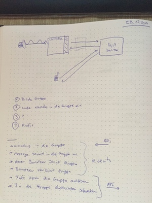
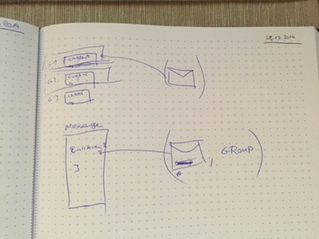

# VotesApp 
**VotesApp** is a *WhatsApp* Bot that helps you and your friends to organize Votes in *WhatsApp* groups.

As *WhatsApp* User the probability that you have a group together with some friends is quite huge. If not try it, it's a great feature. And when you are in a group like, it will happend that someone asks a question like, *Who likes to join Karting on Saturday?*, or *Whats about pizza today after work?*. Maybe you have such voting once a week for a fixed event like playing soccer in the evinig? Then it becomes quite hard to manage this.

Now you just invite **VotesApp** into your *WhatsApp* group.
Once joined, **VotesApp** will listen to the Keywords, `in`, `out`, `yes`, `no` to count votes and `status`, `status [in|out|yes|no]` to give the names of the people which voted for this keyword.

Your Scenario could look like this (mocked with german texts):

To try it, add VotesApp (+4915xxxxx *will be listed when the service is ready*) to your group and start Voting!

# The VotesApp Diary
This project was triggered because of the [Spring Boot Contest](https://github.com/learning-spring-boot/contest). To keep the judges up to date and show them why we decided like this on some points, we try to keep the diary up to date.

So if you are interested in the huzzle we had, have a look :)

## 07.01.2015 - Hello Reactor? Can we vote?
As usual there is a good news and a bad news. Let's start with the bad, because we learned that the last thing you tell stays in our minds :)

Bad News: We are still some huzzle with the Python Backend. But we think we can finish it by tomorrow and then fully concentrate on the contest`s goal!

Good News: To avoid having nothing by now, we added a simple ["ConsoleClient"](src/main/java/de/votesapp/client/ConsoleClient.java) to fake the WhatsApp Service. That gets loaded when the "yowsup" Profile isn't active. For this we utilized the `!` operator within the `@Profile`-Annotation.

With this we can have our first vote, which proofs that some logic is already working:

To do so, we decided to remove the interfaces we had previously between our API and WhatsApp and use [reactor](https://github.com/reactor/reactor) instead.

The ["Bridge"](src/main/java/de/votesapp/api/WhatsAppClientToReactorBridge.java) between our ["ConsoleClient"](src/main/java/de/votesapp/client/ConsoleClient.java) and Reactor looks like this:

We are looking forward to do more stuff on the Java site within the next days.

## 04.01.2015 - Parallelprogramming (!= Pairprogramming)
Two days ago we met again on an epic go cart event and we had some time to discuss the next steps. We figured out that the yowsup architecture seems to be pretty nice (in terms of flexibility and readability). So we decided that we take the risk, drop Plan A (from 31.12.) and implement "only" a nice Rest-API on top off yowsup. With this the actual Java Code, what the contest is about, stays much cleaner.

With this in mind we decided that one of us will put a ReST-Layer in Python and the other one will go for the Java Code.

The result of today are a view java packages:

They are far away from production-ready, but they show already the way it will go.

On the python/yowsup side we know how to deal with the native events, we know how to send messages and where to register our own methods. The next step will to dig deeper into how to put the ReST-Layer on-top on it.

## 01.01.2015 - Make it public
Today we decided to put our diary online. Also if there is no code yet, we hope it will be interesting enough :).

Funny background, we just registered the domain for the VotesApp. And this is how we decided who as the pleasure to register it and become the domain owner:

## 31.12.2014 - Whats broken??!?!?!
Over the night, more and more people commented on the [*no_route* ticket mentioned](https://github.com/tgalal/yowsup/issues/370) yesterday. We saw that @tgalal was working hard on yowsup but somehow he isn't giving feedback on the registration bug.

When sit together and talking about this, we decided that the broken registration is a show stopper and we need about alternatives.

It seemed that Androids [uiautomatorviewer](http://developer.android.com/tools/testing/testing_ui.html#uianalysis) is the way to go. From our past we know that working with the Android Emulator isn't that nice for newbees (specially if you need to reboot the device often). Anyway we saw the Challenge and started installing the Android SDK, booted the Emulator and installed *WhatsApp* on it.

And hell, yeah! The uiautomatorviewer was able to parse the emulators screen give us needed ui elements content.

Okay, the screenshot was black, but the ui structure was visible and showing its texts.

But then the next challenge started, how to remotecontrol (navigate) this "thing" now? Since we have great Selenium skills, we thought of using the selendroid library to do this. But before going to deep into Android development we had the idea to register manual (on the phone) and then continue using yowsup.

Sounds easy, but the *simple* solutions we found required us to have a rooted android phone. So we tried to root our Android Emulator but it wasn't possible on windows (at least for us). Luckly we found [this article](http://www.digitalinternals.com/security/extract-*WhatsApp*-password-android/374/) telling us how to access the emulators disk to download *WhatsApp*s highly secured passwordfile and read it. :)

That enabled us to send and receive messages over the yowsup-cli.

Okay, that wasn't the full story. We need also to apply this awesome bugfix (we will not share it with the public of course :):

The said story of the day is that the yowsup-cli provides group interaction in the "interactive" mode only. Now the question is how to continue?

### Summary:
* Manual Registration via Emulator with the help of [this](http://www.digitalinternals.com/security/extract-*WhatsApp*-password-android/374/) was possible
* We got in touch with yowsup-cli
* Next steps
 * Plan A: Adjust Yowsup that we can send and receive group messages via the ProcessBuilder
 * Plan B: Use Yowsup as a Template for a small Java Library that only implements the 3 to 4 api calls we need (Group Messages, ...)
* Out of 6h development, we idled 2h watching the Android Emulator booting :(

## 29-30.12.2014 - Showstopper?

On thursday the first huzzle started. In the evening I tried to prepare yowsup (the inoffical *WhatsApp* library written in python) to focus on java when we meet the next time. But already at the installation of the library I got (for a java devs) strange "Tracebacks".

The solution, ... `sudo apt-get install python python-dateutil python-argparse python-setuptools`
... was easy, (if you know it :) ), some common dependencies where missing on my pc.

But it was worth it, I think [our comment](https://github.com/tgalal/yowsup/issues/464#issuecomment-68265182) lead into this commit:
https://github.com/tgalal/yowsup/commit/939af7b9101d6cada50e135710fa6032f67e5921

So our project had the first public benefit :).

But that was not everything.

Once was installed, the first step you need to execute failed because of an *no_route* error. The disappointing thing was, that we found [a ticket](https://github.com/tgalal/yowsup/issues/370) that was filed Nov. 19th and is still not solved.

But who said it should be easy...?

P.S.: My real huzzle was that I'm working on OSX and tried on the same day(s) Docker and Vagrant to get a nice Ubuntu Enviorment to play with :) *-cough-*

## 28.12.2014 - Let's do a Mockup. Damn, it! How are we gonna name this thing?
Today we meet the first time to kick-off the project. We roughly talked about the things we can demonstrate with this idea and made a small analyses which API-Calls we need. When we thought we have everything, we start implementing a first mock in Java.

The list of things we could show looks like this:

Our app will (*hopfully* :) )...,
* be a neat and sweat backend service (focus on spring boot, not on UI)
* have a decent business layer (not too much to program)
* talk/integration another services (advantage of Spring)
* be possible to deploy at Cloud-Foundary (or smth. similiar)
* be easy to test for the judges (common requierement)
* solve a real problem (personal requierment)

Our first API draft looks like this:

**But, ** when we start mocking, the first problem hit us, - How are we going to call our baby?

We tought about the goal of the project (finding dates) in combination with the servers we are coupled with, - WhatApp. Since we use *doodle* to organize our LaserTag events (ya, thats we the nerds will joins and we can use tools like this, ...) we combined 1 and 1. *WhatsApp* and Doodle is: Whoodle. Later we recongnized the Whoodle is a dog breed so we renamed it to:

**-- VotesApp :)**

After mocking the java side (where we know our challanges)
we start searching for the *WhatsApp* integration.
Since this is not what the contest is about, we hoped for a java libary
that has a nice API and is easy to use.

The good news was, we found the [yowsup](https://github.com/tgalal/yowsup) api which sounds promising (1,5k stars), the "not so good" news was, it's written in Python and doesn't have an easy to use webservice (by now).

Today we also got [the offical](https://github.com/learning-spring-boot/contest/issues/1) "go" to join the contest in a team, - yeye :)

### Summary:
* We have a clear picture what we like to archive
* We now where to start
* We now there is a *WhatsApp* Libary that can be used over a cli

## 27.12.2014 - There is a contest
Today we saw the contest and immediately kicked-off an e-mail
brainstorming on our mailing list. We ask our friends who like to join the competition and who has ideas which things currently suck and we could try to do better in a small project like this. Within a few emails the idea of an *WhatsApp* Group Voting tool was born. Looking to the contest judge characteristics (sweat and neat, popularity, ...) we saw the chance to join the competition.

### Our identified Painpoint
Every week we organize in a *WhatsApp* group how many people like to join our private soccer event. Thats quite hard because you have to scroll though the history and check who likes to attend.
This screenshot shows an real example (*"Bin dabei"="I'm in", "Ich auch"="Me too"*):

### The Solution:
*When we are done*,
you can inviate a Bot into your *WhatsApp* Group that counts keywords (like "*Bin dabei*" or "*I'm in*") and then posts a summary when it gets asked (like *Status* or *Status In*).

From some local radio stations we know that there are using *WhatsApp* for TrafficJam reports. So there should be an easy way to get this messages (**we thought...**).
